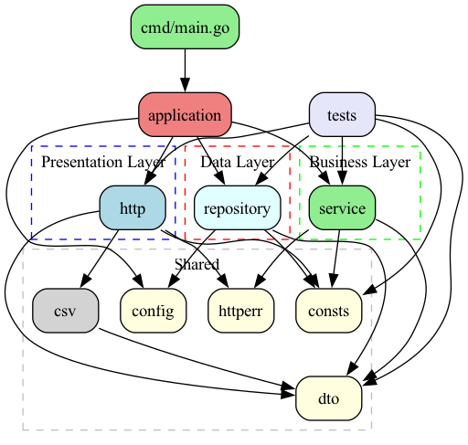

# Wallets

## Обзор проекта

Wallets - это микросервис для управления электронными кошельками, написанный на Go. Сервис предоставляет REST API для создания кошельков, пополнения баланса, переводов между кошельками и просмотра истории операций.

### Основные возможности:
- Создание именованных кошельков
- Пополнение баланса кошелька  
- Переводы между кошельками
- Просмотр истории операций с фильтрацией по дате
- Экспорт операций в CSV формате

## Быстрый старт

### Требования
- Go 1.14+
- PostgreSQL 12+
- Docker и Docker Compose (опционально)

### Запуск с Docker Compose
```bash
# Запустить все сервисы (PostgreSQL + приложение)
docker-compose up

# Запустить в фоновом режиме
docker-compose up -d
```

### Локальный запуск
```bash
# 1. Запустить PostgreSQL
make postgres/up

# 2. Применить миграции БД
make migrate/up

# 3. Запустить приложение
make run
```

### Тестирование
```bash
# Запустить юнит-тесты
make test

# Запустить интеграционные тесты
make test/int
```

### Сборка
```bash
# Собрать бинарный файл
make build

# Собрать Docker образ
make build/docker
```

## Структура проекта

```
.
├── api/
│   └── v1/
│       └── swagger.yaml         # OpenAPI спецификация
├── cmd/
│   └── main.go                  # Точка входа приложения
├── docs/
│   └── diagrams/                # Диаграммы архитектуры
├── internal/
│   ├── application/             # Инициализация и запуск приложения
│   │   ├── application.go
│   │   └── logger.go
│   ├── config/                  # Конфигурация через env переменные
│   │   └── config.go
│   ├── consts/                  # Константы приложения
│   │   └── consts.go
│   ├── csv/                     # Генерация CSV отчетов
│   │   └── operations.go
│   ├── dto/                     # Data Transfer Objects
│   │   ├── amount.go
│   │   ├── deposit.go
│   │   ├── operation.go
│   │   ├── transfer.go
│   │   └── wallet.go
│   ├── http/                    # HTTP слой
│   │   ├── dependencies.go
│   │   ├── errors.go
│   │   ├── handlers.go
│   │   └── server.go
│   ├── httperr/                 # HTTP ошибки
│   │   └── errors.go
│   ├── repository/              # Слой работы с БД
│   │   ├── entities.go
│   │   └── repository.go
│   ├── service/                 # Бизнес-логика
│   │   ├── dependencies.go
│   │   ├── errors.go
│   │   ├── service.go
│   │   └── service_test.go
│   └── tests/                   # Интеграционные тесты
│       └── integration_test.go
├── migrations/                  # SQL миграции
├── docker-compose.yml
├── Dockerfile
├── go.mod
├── go.sum
├── Makefile
└── README.md
```

## Архитектура

Приложение построено по принципу трёхслойной архитектуры с чёткими границами между слоями:



### Слои приложения:

1. **HTTP слой** (`internal/http/`) - обработка HTTP запросов, валидация входных данных, маршрутизация
2. **Service слой** (`internal/service/`) - бизнес-логика, управление транзакциями, валидация бизнес-правил
3. **Repository слой** (`internal/repository/`) - работа с базой данных, SQL запросы

### Ключевые архитектурные решения:

- **Уровень изоляции транзакций**: Используется `sql.LevelSerializable` для всех операций с кошельками, что гарантирует консистентность данных при конкурентных операциях
- **Хранение денежных сумм**: В БД суммы хранятся как `numeric(18,2)`, в Go коде как `float64`
- **Логирование операций**: Все денежные операции записываются в таблицу `operations` для аудита
- **Валидация**: Минимальная сумма операции 0.01, проверяется на уровне HTTP слоя

### База данных

PostgreSQL с двумя основными таблицами:
- **wallets** - информация о кошельках (id, name, balance, created_at, updated_at)
- **operations** - история операций (id, wallet_id, type, amount, created_at)

## Конфигурация

Приложение настраивается через переменные окружения:

| Переменная | Описание | Значение по умолчанию |
|------------|----------|---------------------|
| `DB_HOST` | Хост PostgreSQL | `localhost` |
| `DB_PORT` | Порт PostgreSQL | `5432` |
| `DB_USER` | Пользователь БД | `postgres` |
| `DB_PASSWORD` | Пароль БД | `postgres` |
| `DB_NAME` | Имя БД | `wallets` |
| `APP_PORT` | Порт HTTP сервера | `8080` |
| `LOG_LEVEL` | Уровень логирования | `info` |

## API Endpoints

### POST /v1/wallets
Создание нового кошелька
```json
{
  "name": "My Wallet"
}
```

### POST /v1/wallets/deposit
Пополнение кошелька
```json
{
  "wallet_id": "123e4567-e89b-12d3-a456-426614174000",
  "amount": 100.50
}
```

### POST /v1/wallets/transfer
Перевод между кошельками
```json
{
  "from_wallet_id": "123e4567-e89b-12d3-a456-426614174000",
  "to_wallet_id": "987fcdeb-51a2-43d1-9012-345678901234",
  "amount": 50.00
}
```

### GET /v1/wallets/operations
Получение истории операций с опциональными фильтрами:
- `wallet_id` - ID кошелька
- `from_date` - начальная дата (RFC3339)
- `to_date` - конечная дата (RFC3339)
- `offset` - смещение для пагинации
- `limit` - количество записей

Подробная спецификация API доступна в файле [api/v1/swagger.yaml](api/v1/swagger.yaml).

## Доступные команды

### Makefile команды

| Команда | Описание |
|---------|----------|
| `make build` | Сборка бинарного файла приложения |
| `make test` | Запуск юнит-тестов |
| `make test/int` | Запуск интеграционных тестов |
| `make run` | Запуск приложения |
| `make postgres/up` | Запуск PostgreSQL в Docker контейнере |
| `make postgres/down` | Остановка PostgreSQL контейнера |
| `make migrate/up` | Применение всех миграций |
| `make migrate/down` | Откат последней миграции |
| `make build/docker` | Сборка Docker образа приложения |
| `make diagrams` | Генерация диаграмм из DOT файлов |

### Полезные команды для разработки

```bash
# Просмотр документации пакета
go doc internal/service

# Генерация моков для тестов
go generate ./...

# Проверка покрытия тестами
go test -cover ./...

# Запуск конкретного теста
go test -run TestServiceTransfer ./internal/service
```

## Особенности разработки

### Тестирование
- **Юнит-тесты**: Используют моки репозитория для изоляции бизнес-логики. См. пример в `internal/service/service_test.go`
- **Интеграционные тесты**: Тестируют полный стек с реальной БД. См. `internal/tests/integration_test.go`

### Обработка ошибок
- Кастомные ошибки определены в `internal/httperr/` для правильной HTTP семантики
- Бизнес-ошибки (недостаточно средств, кошелёк не найден) возвращают соответствующие HTTP коды

### Логирование
- Используется структурированное логирование через Zap
- Все операции с деньгами логируются для аудита

### Метрики
- Интегрирован Prometheus для сбора метрик
- Доступны по адресу `/metrics`

## Лицензия

Этот проект распространяется под лицензией MIT. См. файл [LICENSE](LICENSE) для подробностей.